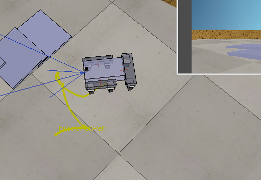

# AutonomousRobotics-Homeworks

This repository contains part of my homeworks to my Autonomous Robotics course.
The lectures were about a broad range of subjects such as mobile robot kinematics, collision avoidance, mapping and localization, etc.

In order to implement the studies methods, we used [ROS](http://www.ros.org/), a *flexible framework for writing robot software*.

## Content
There are five folders in these repositories regarding different topics:

* awesome-joystick: A small warm-up to understand the logic behind ROS.
* collision_avoidance: Automatic control of the velocity of a vehicle when it is encountering obstacles
* face_detect: Using custom messages, playing with datastream to perform face detection
* rover_driver_base: 6 wheeled-vehicle kinematics
* floor_nav: Scheduling task for a little vehicle (this one is not finished)

